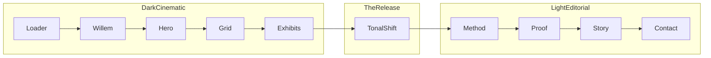

# Premium Master Narrative

> **Status:** Approved · Phase 0 complete  
> **Owner:** Ahmed Mohsen Mostafa  
> **Route:** `#prototype` on branch `premium/prototype`  
> **Theory:** [Translator Arc](./PREMIUM_NARRATIVE_BRIEF.md)  
> **Schedule:** [PREMIUM_ROADMAP.md](./PREMIUM_ROADMAP.md)

---

## Sources synthesized

| Source | What it contributes |
|--------|---------------------|
| **CV PDF** (`Ahmed_Mostafa_Full_Profile_With_Freelance_Certs.pdf`) | 7 roles 2011–2025 · BBA Odisee 2026 + BSc Computer Science MUST 2017 · 5 skill lanes · project signals (Volvo STP/SWOT/PESTEL, Tackle pricing intel, CINEMATEK/MOSOL) · freelance (ITIDA, MyWE Egypt Telecom) |
| **LinkedIn** | [ahmed-mohsen-hanafy](https://www.linkedin.com/in/ahmed-mohsen-hanafy/) — public positioning, endorsements, activity tone |
| **ahmedmohsenmostafa.com** | Refined recruiter copy: hero thesis, Earlier/Then/Now journey, 4 cases with roles, 3 capabilities, recruiter FAQ, 48h contact promise |
| **ahmedmohsenmostafa.netlify.app** | Deploy mirror (same intent as `.com`; use `.com` as copy source if netlify sleeps) |
| **`packages/shared/src/content.ts`** | Metrics, journey arc, CV experience, `impactMetrics`, `capabilities`, `serviceFit`, `contactClose` |
| **`socialGridData.ts`** | 22-cell campaign mosaic — Volvo video, CINEMATEK decades, Le Lièvrier noir |

### Gaps vs live `.com` (implementers: fix in Phase B/C, do not invent)

| Gap | Repo today | Live `.com` has |
|-----|------------|----------------|
| Hero thesis | `profile.headline` — operational | “Marketing with structure, curiosity, and intent.” |
| Journey | `cvExperience` list in Story 05 | Earlier / Then / Now three-beat arc |
| Capabilities | `methodBeats.ts` — 4 editorial beats | 3 pillars: Research & Insight · Campaign & Content · Data, Automation & Execution |
| Case roles | Exhibit taglines only | Account Manager · Strategy Support · Product Strategist · Strategist & Designer |
| Contact | `hello@example.com` placeholder | Real email + 48h reply promise |

**Rule:** Pull polished copy from `.com` into `content.ts` during implementation phases — the master narrative defines *where* copy lives, not new voice.

---

## 1. Positioning

**One sentence:**

> I turn business problems into campaigns that are researched like strategy, built like software, and delivered like operations.

**Sub-line (hero / nav):**

> Research-led marketing, engineered to ship.

**Who this is for:**

Marketing student (Odisee BBA, expected 2026), Brussels — **not** senior IT. Eleven years of range (customer service → CRM → software → IT leadership → consulting) reframed as **marketing operating system**, not résumé breadth.

**Primary conversion:** Download CV · Summer 2026 internship · Belgium & EU.

**Audience scan path:** HR director / marketing lead decides in ~90 seconds whether to scroll or download — design for that, not for peers.

---

## 2. Translator Arc — four lenses

Ahmed translates business problems → **campaigns**, **systems**, **experiences** — with proof at each layer.

| Lens | Proves | Visitor question |
|------|--------|------------------|
| **Marketing** (spine) | Strategy, CRM, content, messaging, campaigns, martech | “Can he think like our marketing team?” |
| **Build** | Software, delivery, ops, cloud, automation | “Can he ship what he strategizes?” |
| **Experience** | UI/UX, frames, editorial craft — *this site is the proof* | “Will our brand look credible in his hands?” |
| **Communication** | Client-facing arc 2011→now | “Can he hold a brief / a room / a stakeholder?” |

### Lead / support per act

| Act | Section | Lead lens | Support lenses |
|-----|---------|-----------|----------------|
| 0 | Willem | Communication | Experience |
| 1 | Hero | Marketing | Experience |
| 1.5 | Campaign grid | Marketing | Experience |
| 2 | Exhibits (3 flagship) | Marketing | Build · Experience |
| — | **The Release** | Experience | Marketing |
| 3 | Method | Marketing | Build |
| 4 | Proof | Marketing | Build |
| 5 | Story 05 | Communication | Marketing |
| 5 | Story 06 | Marketing | Communication |
| 6 | Contact | Communication | Marketing |

---

## 3. Tonal spine (hybrid — approved)



| Zone | Sections | Mood | Reference |
|------|----------|------|-----------|
| **Dark cinematic** | Loader → Willem → Hero → Grid → Exhibits | Forest ink `.pf-cinematic`, ember accent | A24 titles, campaign theatre |
| **The Release** | Exhibits unpin → Method enter | Dark → cream transition; ember punctuation ≤0.35 opacity | Lights come up in a theatre |
| **Light editorial** | Method → Proof → Story → Contact | Cream `--pf-paper`, Instrument, rules, whitespace | Guardian longform, live `.com` |

Cream is **earned**, not default. Dark is the show; light is the business case.

---

## 4. Marketing funnel → scroll script

| Act | Component | Funnel | Visual (what user sees) | Emotion | Motion / stillness |
|-----|-----------|--------|-------------------------|---------|-------------------|
| — | Loader | — | Monogram, line | Settle in | Minimal GSAP |
| 0 | `WillemHandoff` | Awareness | Name from poster aperture | “Who is this?” | **Sacred — frozen** |
| 1 | `HeroFrameReveal` + `HeroStoryStage` | Interest | Dark thesis + rotating campaign still | “He has a POV” | Pin + fade; story auto-rotate |
| 1.5 | Campaign grid (`socialGridData`) | Awareness → Interest | Unequal mosaic; Volvo video cell | “Platform-native proof, real volume” | Scroll-reveal; last row withheld until scroll |
| 2 | `FeaturedExhibits` | Consideration | 3 flagship pins: Volvo · CINEMATEK · Le Lièvrier | “Depth, not just posters” | Long pin carousel + meter scrub |
| — | **The Release** | Consideration | `.pf-cinematic` → light; subtle ember scrim | “Lights up — now the case” | Tonal lock removal; scrub ≤0.35 |
| 3 | `MethodSection` | Consideration | 3 capabilities (Research / Campaign / Data-Automation) | “How he thinks” | Rail tab-sync; line reveals on enter |
| 4 | `ProofDossiersSection` | Evaluation | Metric dossiers: 40% · 27% · 82% · 99.5% | “Evidence, not adjectives” | Clip reveal + count-up |
| 5 | `StoryExperienceSection` | Evaluation → Decision | Earlier / Then / Now | “The journey earns trust” | Pinned chapter rail (Phase C redesign) |
| 5 | `StoryFitSection` | Decision | Internship roles · team fit | “He fits us” | Staggered fade cascade |
| 6 | `07_ContactClosePrototype` | Decision | One loud CV CTA · 48h reply | “Download, reach out” | Finale pin; magnetic CV only here |

### Live stack order (`Prototype.tsx`)

```
Loader → Willem → Hero → [NEW: Campaign Grid] → FeaturedExhibits → Method → Proof → Story 05 → Story 06 → Contact 07
```

---

## 5. Attention map — five moments only

Everything else is still, tonal, supporting. Motion budget is finite.

| # | Moment | Section | Marketing job |
|---|--------|---------|---------------|
| **1** | Willem name emergence | Act 0 | Identity lands — name is the logo |
| **2** | Campaign grid reveal | Act 1.5 | Marketing spine announced — breadth of proof |
| **3** | One exhibit poster owns viewport | Act 2 | Craft — one campaign at full scale during pin |
| **4** | **The Release** — dark to light | Transition | Signature beat — theatre becomes business case |
| **5** | Contact CV finale | Act 6 | Conversion — Download CV lands last |

**Not attention moments:** nav shrink, custom cursor, scroll velocity skew, per-header MaskedWords on every section.

---

## 6. Campaign media grid

### Placement

- **Where:** Act 1.5 in `#prototype` — **between Hero thesis and Featured Exhibits**
- **Why:** Funnel bridge — Awareness (volume) → Consideration (depth)
- **Source:** [`src/app/social/socialGridData.ts`](../src/app/social/socialGridData.ts) — 22 cells, unequal layout
- **Strip:** `#social` lab banner, Majd links, duplicate profile chrome — **media mosaic only**
- **Skin:** Dossier Signal typography on grid chrome; not literal Instagram UI

### Handoff

| Element | Default | Alternative |
|---------|---------|-------------|
| Flyer cell | `heroScrollPick` → Le Lièvrier noir (`lievrier` cell) | Volvo video cell (`volvo-hero`) |
| Target | Lead exhibit plate in `FeaturedExhibits` | Same flagship as flyer |
| Motion | One poster scales / flies into exhibit pin lead | Only if in beat sheet — no 360° spin |

### Scroll unlock

- Last row of grid **withheld** (blur or clip) until user scrolls — recruiter earns the feed
- Full grid visible → exhibits section enters → depth case begins

### Flagship trio (depth — approved)

| Case | Role (from `.com`) | Repo asset root |
|------|-------------------|-----------------|
| **Volvo Belgium** | Account Manager · Made in Belgium STP/SWOT | `/projects/volvo/` |
| **CINEMATEK** | Strategy Support · Decades of Cinema | `/projects/cinematek/` |
| **Le Lièvrier** | Brand / café campaign · noir frame | `/projects/le-lievrier/` |

MOSOL + Marketing Intelligence stay in grid breadth — not equal pinned exhibits (Phase 2 scope if needed later).

---

## 7. Copy hierarchy (≤3 lines above fold per act)

| Act | Line 1 | Line 2 | Line 3 | Source |
|-----|--------|--------|--------|--------|
| **Hero** | `profile.name` | Marketing with structure, curiosity, and intent. | `profile.heroFine` (trimmed) | `.com` hero + `content.ts` |
| **Grid** | — | Cell `eyebrow` only | Cell `title` on hover/focus | `socialGridData` |
| **Exhibits** | Case title | Role on project | One outcome line | `.com` case cards + `featuredExhibits` |
| **Method** | Capability header (×3) | One supporting line each | — | `.com` capabilities → merge into `methodBeats` or replace |
| **Proof** | Metric value + suffix | `impactMetrics[].label` | `impactMetrics[].context` | `content.ts` |
| **Story 05** | Earlier | Then | Now | `.com` journey — replace list-style Story 05 |
| **Story 06** | Summer 2026 internship | `serviceFit[].t` (×3 cards) | `serviceFit[].fit` | `content.ts` |
| **Contact** | `contactClose.heading` join | `contactClose.lede` | Download CV · 48h reply | `content.ts` + `.com` contact |

---

## 8. Phase scopes (implementer agents)

### Phase A — Front third (includes grid — Phase D folded in)

**Goal:** Dark cinematic show + breadth grid + 3 exhibit pins + **The Release**

| In scope | Files |
|----------|-------|
| Hero pin / fade | `useHeroScrollSequence.ts`, `HeroFrameReveal.tsx`, `HeroStoryStage.tsx` |
| Campaign grid mount | `Prototype.tsx`, extract from `SocialGridTeaser.tsx`, `social-narrative.css` (grid only) |
| Grid handoff | `SocialHandoffPin.tsx` pattern or new `CampaignGridHandoff.tsx` |
| Exhibits pin | `FeaturedExhibits.tsx`, `useExhibitScrollSequence.ts` (additive wrapper only) |
| The Release | `Prototype.tsx` tonal lock, optional `HeroExhibitHandoff.tsx`, `theme.css` / `awwards.css` |
| Copy | Hero thesis line from `.com` |

| Out of scope | |
|--------------|--|
| WillemHandoff internals | Sacred |
| Method, Proof, Story, Contact | Phase B/C |
| CustomCursor, ScrollVelocity | Phase E |
| `site-reveal--beneath` opacity &lt; 1 | Never |

**Doc:** [PREMIUM_PHASE_A.md](./PREMIUM_PHASE_A.md) — update beat sheet to include grid + Release.

### Phase B — Middle

**Goal:** Light editorial Method + Proof evaluation

| In scope | Detail |
|----------|--------|
| Method | Re-map to 3 `.com` capabilities; rail tab-sync; line reveals |
| Proof | Marketing metrics first (40%, 27%); ops metrics as range (82%, 99.5%); count-up |
| Copy | Pull capability copy from `.com` into `content.ts` / `methodBeats.ts` |
| Style | Confirm light zone — no `.pf-cinematic` on root below Release |

### Phase C — Back third

**Goal:** Communication lens + conversion

| In scope | Detail |
|----------|--------|
| Story 05 | Earlier/Then/Now **pinned chapter rail** — not CV list |
| Story 06 | `serviceFit` cards — internship decision |
| Contact 07 | Finale pin; `.contact-close-prototype__*` orb; magnetic CV; real email |
| Copy | `contactClose` + 48h promise |

### Phase D — Folded into A

Campaign grid integration is **not** a separate phase. See Phase A.

### Phase E / F

Unchanged per [PREMIUM_ROADMAP.md](./PREMIUM_ROADMAP.md).

---

## 9. Structural references (steal structure, not skin)

| Reference | Steal |
|-----------|-------|
| **A24 title cards** | Pacing of The Release — hold dark, then cut to light |
| **Guardian longform** | Method + Proof rhythm — rules, lede, pull quotes |
| **Bloomberg Terminal** | Proof metric density — numbers as interface |
| **Framer campaign portfolios** | Grid mosaic grammar — unequal cells, cover art hierarchy |
| **Nils Frahm live** | Quiet-loud dynamics — motion budget = 5 moments only |
| **Live ahmedmohsenmostafa.com** | Copy voice, capabilities, journey, recruiter FAQ |

---

## 10. Open questions for Ahmed

Non-blocking — defaults assumed if unanswered before Phase A implement.

| # | Question | Default if silent |
|---|----------|-------------------|
| 1 | Grid handoff cell: Le Lièvrier noir or Volvo video? | Le Lièvrier noir (`heroScrollPick`) |
| 2 | Metrics in Proof: marketing-first (40/27) or all six equal? | Marketing first; ops as “range” row |
| 3 | Case depth: link to `.com` case pages or self-contained in prototype? | Self-contained scroll; link optional in exhibit overlay |
| 4 | Contact: wire `Ahmed.ha.mahmoud@outlook.com` now or Phase F? | Phase C |

---

## 11. Anti-patterns (carry forward)

- Copying `MaskedWords` onto every static header
- `opacity: 0.4` on `site-reveal--beneath` (pale ghost site)
- Full-site awwwards checklist in one agent session
- 360° spins / cartoon scale without narrative purpose
- Positioning as senior IT / full-stack developer first
- Second accent color, Inter/Roboto, skill bars

---

## 12. Approval

| Item | Status |
|------|--------|
| Hybrid tonal arc | Approved |
| 3 flagship exhibits + grid breadth | Approved |
| Five-moment attention map | Approved |
| Phase D folded into Phase A | Approved |
| Phase A unblocked | Yes — proceed to Sonnet beat sheet → Composer |

**Next step:** [PREMIUM_ROADMAP.md](./PREMIUM_ROADMAP.md) → Phase A1 (Sonnet beat sheet).
