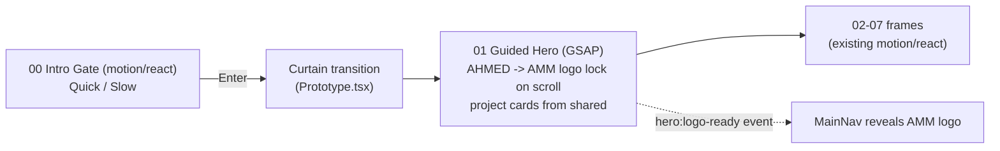

# Plan 01 — Landing Merge: Intro Gate + GSAP Hero into the Studio Journey

Planning Engineer: Opus 4.8. Scope: sequence the work and assign a subagent model per task.

## Locked decisions

| Decision | Choice |
|----------|--------|
| Landing entry | Studio **Intro Gate** (`00_IntroGate` — "Don't tell. Show." + Quick/Slow) stays as the gate |
| Architecture | **Port** the guided-hero GSAP name->logo hero INTO the Studio Vite app (one unified app) |
| Content source | Text from `apps/martech/src/lib/data.js` -> `packages/shared/src/content.ts` |
| Photos | Live elsewhere (`am-logo.png` confirmed in `Files for V2 portfolio`); martech `public/` is placeholders only |

## Target experience flow

## Stack reality (what porting must reconcile)

| Concern | Studio (`src/`) | Guided-hero (`apps/guided-hero/`) | Action |
|---------|-----------------|-----------------------------------|--------|
| Bundler | Vite + React 18 | Next.js 16 + React 19 | Drop `"use client"`, drop `@/lib/*` Next imports |
| Motion | `motion/react` | `gsap` + `@gsap/react` + `lenis` | Add `gsap`, `@gsap/react` to Studio deps; isolate GSAP in scoped container |
| Tokens | `--pf-*` (paper/ink, light) | `--bg`, `--text-primary`, `--accent`, `--border`, `--card-bg` (dark) | Map hero vars to `--pf-*` or add hero-scoped token block |
| Logo handoff | `MainNav` in `Prototype.tsx` | dispatches `window` event `hero:logo-ready` | Wire listener in MainNav |

Per `@gsap/react` docs (context7): use `useGSAP(fn, { scope: ref, revertOnUpdate: true })`; ScrollTriggers created in scope are auto-reverted. Do NOT attach `motion/react` `useScroll` to the same DOM nodes the GSAP hero pins.

## Phases, tasks, and suggested models

Model legend (mapped to available subagent slugs):
- Composer 2.5 (easy) -> `composer-2.5-fast` (note: only the "fast" variant is available as a subagent)
- Composer 2.5 fast (copy/simple) -> `composer-2.5-fast`
- Sonnet 4.6 (brainstorm w/ Opus) -> `claude-4.6-sonnet-medium-thinking`
- GPT 5.5 (beautiful phrasing) -> `gpt-5.5-medium`
- Codex (heavy port/refactor) -> `gpt-5.3-codex` (suggested for the GSAP port; confirm if you want it)

### Phase 0 — Foundation (deps + gsap client)
- [ ] Add `gsap` + `@gsap/react` to root `package.json` (Studio); `npm install`.
- [ ] Create `src/app/motion/gsapClient.ts` (register `ScrollTrigger`, SSR-safe guard removed — Vite is CSR).
- Model: **`composer-2.5-fast`** (mechanical, low-risk).

### Phase 1 — Port the hero component
- [ ] Create `src/app/components/hero/GuidedHero.tsx` from `apps/guided-hero/components/Hero.jsx` + `lib/hero-timeline.js`.
- [ ] Convert: remove Next directives, swap imports, `useGSAP({ scope, revertOnUpdate: true })`, type the refs.
- [ ] Map dark `--bg/--text-primary/--accent/--border/--card-bg` to Studio tokens (or scoped `.guided-hero { ... }` block in `theme.css`).
- [ ] Replace hardcoded `EGYFWD/Halan/InDrive` cards with `featuredProjects` from `@portfolio/shared/content`.
- Model: **`gpt-5.3-codex`** or **`claude-4.6-sonnet-medium-thinking`** (non-trivial framework port). Brainstorm choreography tradeoffs with Opus first.

### Phase 2 — Wire into the journey
- [ ] In `src/app/components/Prototype.tsx`, swap frame `01` (`<Hero.Desktop fluid />`) for `<GuidedHero />`.
- [ ] Add `hero:logo-ready` listener in `MainNav` to reveal the `AMM` mark.
- [ ] Verify Quick/Slow path still reaches the GSAP hero (curtain -> pin) without scroll conflicts.
- Model: **`claude-4.6-sonnet-medium-thinking`** (integration + event wiring).

### Phase 3 — Content + assets
- [ ] Expand `packages/shared/src/content.ts` with martech `data.js` copy (hero headline, status, project challenge/role/takeaway).
- [ ] Copy `am-logo.png` (+ real project photos, once folder is provided) into `public/`.
- [ ] Point hero cards + frame `04_CaseStudies` to real images.
- Model: copy/phrasing -> **`gpt-5.5-medium`**; file moves/data wiring -> **`composer-2.5-fast`**.

### Phase 4 — QA
- [ ] `npm run build` clean; `npm run dev` manual pass: gate -> curtain -> GSAP pin -> logo lock -> frames 02-07.
- [ ] `prefers-reduced-motion` + mobile fallbacks intact.
- Model: **`composer-2.5-fast`** (build/run), escalate failures to Opus/Sonnet.

## Open inputs needed from you
1. Path to the **real project photos** (you chose "elsewhere" — point me to the folder).
2. Confirm **Codex** (`gpt-5.3-codex`) is acceptable for the Phase 1 port, or keep it on Sonnet 4.6.
3. Hero name lock target: morph to **AMM** monogram (from `am-logo.png`) or keep full "AHMED MOHSEN MOSTAFA" compacted?

## Files in play
- Port from: [apps/guided-hero/components/Hero.jsx](apps/guided-hero/components/Hero.jsx), [apps/guided-hero/lib/hero-timeline.js](apps/guided-hero/lib/hero-timeline.js)
- Into: [src/app/components/hero/GuidedHero.tsx](src/app/components/hero/GuidedHero.tsx) (new)
- Wire: [src/app/components/Prototype.tsx](src/app/components/Prototype.tsx), [src/app/components/frames/00_IntroGate.tsx](src/app/components/frames/00_IntroGate.tsx)
- Content: [packages/shared/src/content.ts](packages/shared/src/content.ts), [apps/martech/src/lib/data.js](apps/martech/src/lib/data.js)
